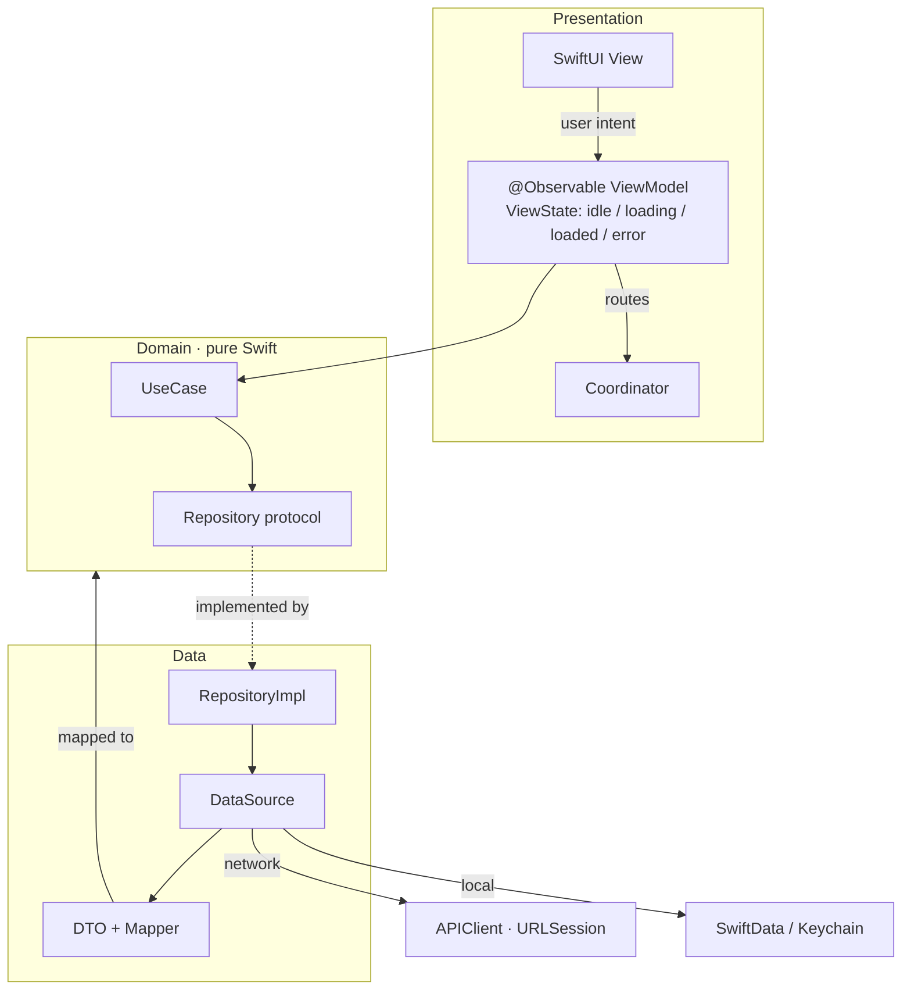
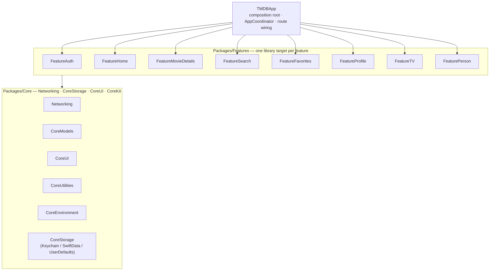

# TMDB Showcase App

[](https://github.com/AhmedRaslan2022/TMDB_2026/actions/workflows/ci.yml)


A portfolio-grade iOS app built on [The Movie Database (TMDB) API](https://developer.themoviedb.org/docs), designed to demonstrate senior-level iOS engineering: Clean Architecture, modern Swift concurrency, modular SPM design, coordinator-driven navigation, full internationalization, and multi-environment CI/CD tooling.

Every decision optimizes for **code a reviewer would praise** over speed.

> Sprint progress lives in [`docs/STATUS.md`](docs/STATUS.md); the full backlog in [`docs/SPRINTS.md`](docs/SPRINTS.md); the QA bug log in [`docs/BUGS.md`](docs/BUGS.md).

## Features

- **Auth** — TMDB v4 web-token login + guest sessions; session persisted in the Keychain and restored on launch.
- **Home** — trending / popular / now-playing / upcoming / top-rated carousels, fetched in parallel with a `TaskGroup`.
- **Movie details** — overview, rating ring, cast, videos, similar & recommended; favorite / watchlist / rate with optimistic UI.
- **Search & Discover** — debounced search with recents; advanced discovery by genre, year, rating, and sort.
- **Favorites & Watchlist** — offline-first, SwiftData-backed, synced with the account.
- **TV & Person** — TV show details and person filmography (mixed movie/TV credits).
- **Profile & Settings** — account, theme, content language, and user-selectable alternate app icons.
- **i18n** — full English + Arabic with live RTL switching; **a11y** — VoiceOver labels/traits and Dynamic Type.

## Architecture

Clean Architecture per feature, MVVM presentation, and a coordinator that owns all navigation.



- **Clean Architecture per feature** — `Domain` (pure Swift entities + use-case/repository protocols) → `Data` (DTOs, mappers, data sources, repository impls) → `Presentation` (MVVM). Domain imports no Codable/SwiftData/SwiftUI/Foundation-networking. DTOs never leak past Data.
- **Modern concurrency only** — async/await, actors, `TaskGroup`, `AsyncSequence`. No Combine, no completion handlers.
- **Observation framework** — `@Observable` / `@Bindable`; never `ObservableObject` / `@Published` / `@StateObject`.
- **Coordinator pattern** — every tab owns a `NavigationStack` bound to a child coordinator; routes are `Hashable` enums mapped in the app target; sheets/covers are coordinator-driven. Views never push or present.
- **Dependency injection** — protocol-based constructor injection composed in `AppContainer`; the app target is a composition root only.
- **No third-party networking/reactive libraries** — `URLSession` + a custom async `APIClient` (with a decorator that logs pretty-printed, secret-redacted requests/responses in Dev/Test). The only dependency is a **test-only** snapshot-testing library.

## Module graph



**Dependency rules:** features never import other features (cross-feature navigation goes through coordinators in the app target); `Core` never imports features; `SharedTestSupport` (Packages/Shared) is linked into test targets only.

## Screenshots

Automated App Store screenshots (English + Arabic/RTL) are produced by `fastlane screenshots` into `fastlane/screenshots/` — see [`fastlane/SETUP.md`](fastlane/SETUP.md).

<!-- Drop captured media here once generated, e.g.:
| Home | Details | Search | Arabic (RTL) |
|---|---|---|---|
|  |  |  |  |
-->

## Environments

| Scheme | Config | Bundle ID | Display name | Codegen |
|---|---|---|---|---|
| TMDB-Dev | Dev | `….TMDB.dev` | TMDB Dev | debug |
| TMDB-Staging | Staging | `….TMDB.staging` | TMDB STG | release |
| TMDB-Test | Test | `….TMDB.test` | TMDB Test | debug |
| TMDB-Live | Live | `….TMDB` | TMDB | release |

Environment values flow `Configs/*.xcconfig` → Info.plist → `CoreEnvironment.AppEnvironment` (type-safe, traps on misconfiguration in debug). The TMDB API is authenticated with the **v4 Read Access Token** as an `Authorization: Bearer` header (not the v3 `api_key` query param).

## Getting started

1. **Clone & open**
   ```sh
   git clone git@github.com:AhmedRaslan2022/TMDB_2026.git && cd TMDB
   open TMDB.xcworkspace
   ```
2. **Secrets** — copy the example and paste your [TMDB v4 Read Access Token](https://www.themoviedb.org/settings/api):
   ```sh
   cp Configs/Secrets.example.xcconfig Configs/Secrets.xcconfig
   # edit Configs/Secrets.xcconfig — it is git-ignored, never commit it
   ```
3. **Tooling**
   ```sh
   brew install swiftlint swiftformat
   git config core.hooksPath .githooks   # enables the pre-commit lint hook
   ```
4. **Run** — select `TMDB-Dev` and hit ⌘R. Debug builds log the network exchange (pretty-printed, secrets redacted) under the `Network` log category.

## Testing

- **Swift Testing** (`@Test` / `#expect`) for unit tests; XCTest only for UI tests. Every use case, ViewModel, and mapper is unit-tested in the same PR as the code.
- Networking is tested through `URLProtocol` stubs; SwiftData through in-memory containers; the Keychain through a dedicated test service — **no test touches the network**.
- Run package tests: `swift test` inside a package (e.g. `Packages/Core/Networking`), or ⌘U on the `TMDB-Test` scheme (app unit + UI tests). UI tests run offline via the `-uitest-stubs` seam.
- SwiftData behaves differently on the macOS host vs iOS; anything touching the real container is covered by an iOS-executed app-target test, not only a package test.

## CI/CD

- **GitHub Actions** ([`.github/workflows/ci.yml`](.github/workflows/ci.yml)) runs on every PR into `develop`/`main`: a **lint** job (SwiftFormat + SwiftLint, identical to the pre-commit hook), a **unit-tests** job (host `swift test` for pure Core packages), a **build-test** job (`xcodebuild test` on the Test scheme, iOS simulator), and a **per-environment build matrix** (Dev/Staging/Test/Live). `Secrets.xcconfig` is recreated from the `TMDB_ACCESS_TOKEN` repo secret — never committed.
- **Fastlane** ([`fastlane/`](fastlane/)) scaffolds `lint` / `test` / `beta` (Staging → TestFlight) / `release` (Live → App Store) lanes, `match` code signing (git-stored in a separate private repo), and `snapshot` for EN + AR screenshots. Distribution lanes require Apple signing assets — see [`fastlane/SETUP.md`](fastlane/SETUP.md).

## Key decisions

| Decision | Why |
|---|---|
| Observation over `ObservableObject`/Combine | Modern, less boilerplate, no reactive-graph surprises; concurrency via async/await + actors keeps data flow explicit. Enforced by custom SwiftLint rules. |
| Coordinator owns all navigation | Views stay declarative and testable; cross-feature routing lives in the app target so feature packages never depend on each other. |
| One SPM package per Core module, feature targets in one `Features` package | Enforces the `Features → Core` dependency direction at the build-graph level; a feature literally cannot import another feature. |
| v4 Bearer token, injected by an interceptor inside the client | The token is invisible to the logging decorator and other layers; combined with recursive key redaction, secrets never reach logs. |
| Secrets only in git-ignored `Secrets.xcconfig`, injected in CI | The TMDB token is never committed, printed, or placed in source; CI writes it from a repo secret at build time. |
| SwiftData for app data, Keychain for session/tokens | Sensitive material never lands in UserDefaults/SwiftData/source; repositories hide the data origin (offline-first where specified). |
| String Catalogs + `bundle: .module` from day one | Per-module localization (EN + AR) with graceful English fallback; live RTL switch rebuilds the shell so mirroring applies cleanly. |
| Snapshot-testing is the only dependency, and test-only | A reference-image diff engine isn't worth hand-rolling; it never links into shipping code. |

## Project structure

```
TMDBApp/            app target — composition root, AppCoordinator, route wiring
Packages/Core/      Networking · CoreStorage · CoreUI · CoreKit (CoreModels + CoreUtilities + CoreEnvironment)
Packages/Features/  FeatureAuth · Home · MovieDetails · Search · Favorites · Profile · TV · Person
Packages/Shared/    SharedTestSupport (mocks/stubs — test targets only)
Configs/            xcconfig (Shared + git-ignored Secrets)
Enviroments/        per-env xcconfig (Dev/Staging/Test/Live)
.github/workflows/  CI pipeline
fastlane/           lanes, match, snapshot (see SETUP.md)
docs/               SPRINTS · STATUS · BUGS
```

## Git workflow

Branches `sprint-N/task-N.M-name` off `develop`; conventional commits (`feat:`/`fix:`/`test:`/`chore:`/`refactor:`/`docs:`); one squash-merged PR per task. `main` is release-only. SwiftLint + SwiftFormat must pass (pre-commit hook + CI) before every commit.
