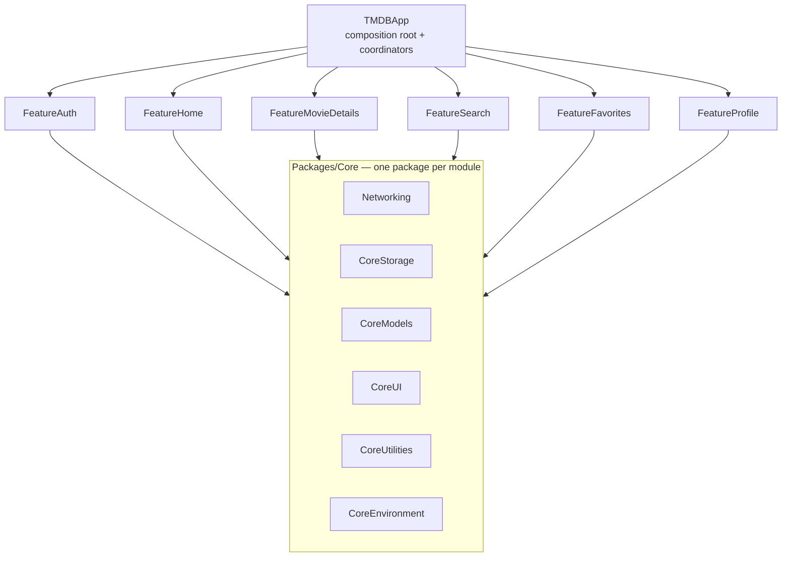

# TMDB Showcase App

A portfolio-grade iOS app built on [The Movie Database (TMDB) API](https://developer.themoviedb.org/docs), designed to demonstrate senior-level iOS engineering: Clean Architecture, modern Swift concurrency, modular SPM design, and multi-environment tooling.

> Sprint progress lives in [`docs/STATUS.md`](docs/STATUS.md); the full backlog in [`docs/SPRINTS.md`](docs/SPRINTS.md).

## Architecture

- **Clean Architecture per feature** — each feature package layers `Domain` (pure Swift entities + use cases) → `Data` (DTOs, mappers, repositories) → `Presentation` (MVVM with `@Observable` ViewModels exposing a single `ViewState` enum).
- **Modern concurrency only** — async/await, actors, `TaskGroup`, `AsyncSequence`. No Combine, no completion handlers.
- **Observation framework** — `@Observable` / `@Bindable`; never `ObservableObject`.
- **Coordinator pattern** — all navigation is coordinator-driven; views never push or present. Routes are `Hashable` enums mapped in the app target.
- **Dependency injection** — protocol-based constructor injection composed in `AppContainer` (the app target is a composition root only).
- **No third-party networking/reactive libraries** — `URLSession` + a custom async `APIClient`.

## Module Graph



Rules: features never import other features (cross-feature navigation goes through coordinators in the app target); `Core` never imports features; `SharedTestSupport` (Packages/Shared) is linked into test targets only.

## Environments

| Scheme | Config | Bundle ID | Display name | Codegen |
|---|---|---|---|---|
| TMDB-Dev | Dev | `….TMDB.dev` | TMDB Dev | debug |
| TMDB-Staging | Staging | `….TMDB.staging` | TMDB STG | release |
| TMDB-Test | Test | `….TMDB.test` | TMDB Test | debug |
| TMDB-Live | Live | `….TMDB` | TMDB | release |

Environment values flow `Configs/*.xcconfig` → Info.plist → `CoreEnvironment.AppEnvironment` (type-safe, traps on misconfiguration in debug).

## Getting Started

1. **Clone & open**
   ```sh
   git clone <repo-url> && cd TMDB
   open TMDB.xcworkspace
   ```
2. **Secrets** — copy the example and paste your [TMDB v4 Read Access Token](https://www.themoviedb.org/settings/api):
   ```sh
   cp Configs/Secrets.example.xcconfig Configs/Secrets.xcconfig
   # edit Configs/Secrets.xcconfig — it is git-ignored, never commit it
   ```
3. **Tooling**
   ```sh
   brew install swiftlint swiftformat
   git config core.hooksPath .githooks   # enables the pre-commit lint hook
   ```
4. **Run** — select the `TMDB-Dev` scheme and hit ⌘R. In debug builds a launch smoke check logs the `/configuration` call result under the `SmokeCheck` log category.

## Testing

- **Swift Testing** (`@Test` / `#expect`) for unit tests; XCTest only for UI tests.
- Networking is tested through `URLProtocol` stubs — no test touches the network.
- Run package tests: `swift test` inside a package (e.g. `Packages/Core/Networking`), or ⌘U on the `TMDB-Test` scheme.

## Git Workflow

Branches `sprint-N/task-N.M-name` off `develop`, conventional commits, squash-merged per task. `main` is release-only.
